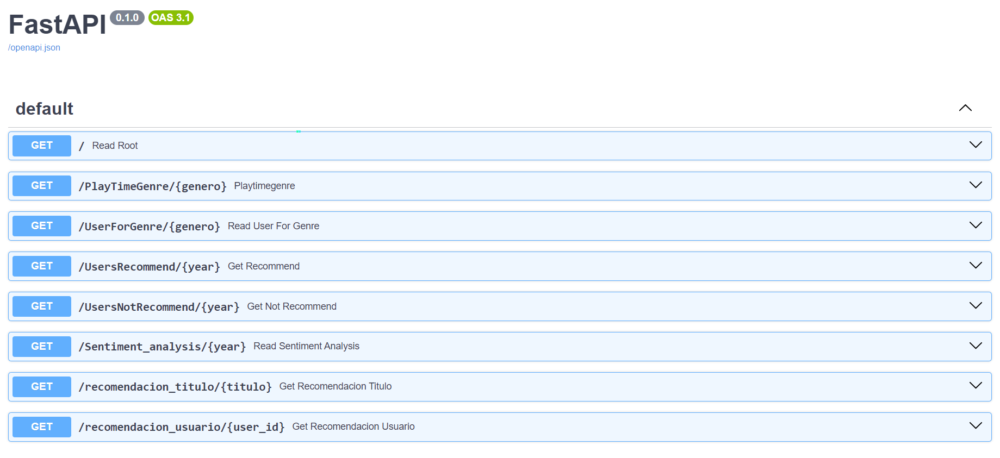
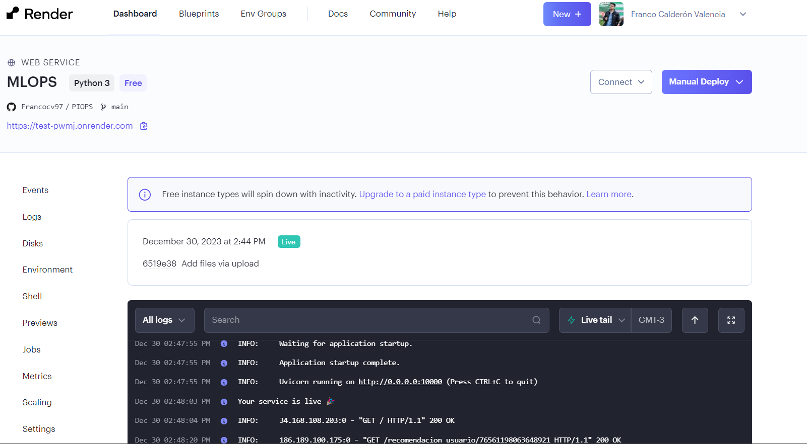
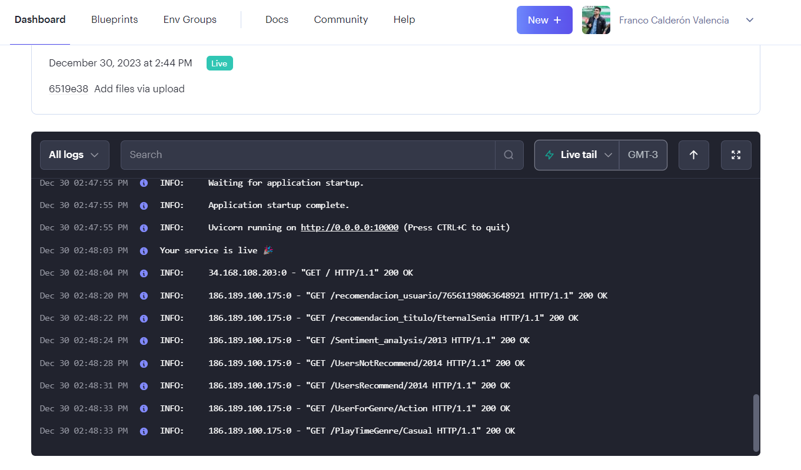

# Primer Proyecto Individual MLOps

Este proyecto aborda el ciclo de vida completo de un proyecto de Machine Learning, desde la ingeniería de datos hasta la implementación de una API para consumir las consultas y recomendaciones. A continuación, encontrarás una guía detallada sobre cómo se aborda cada aspecto del proyecto.

## Descripción del Problema

Como MLOps Engineer en Steam, te enfrentas al desafío de llevar un modelo de recomendación de videojuegos al mundo real. Los datos iniciales son crudos y poco maduros, lo que requiere un trabajo rápido de Data Engineering para preparar un Minimum Viable Product (MVP).

## Desarrollo o Tratamiento de Datos

### Transformaciones o ETL 

A partir de las bases de datos entregadas en archivos json se trabajaron las transformaciones en dataframes, haciendo posible un trabajo mas preciso y complejo con los datos. Se eliminaron columnas presindibles para esta etapa, también se conservaron solo las columnas necesarias para realizar las consultas.

### Feature Engineering

El codigo de esta estapa se trato en un jupyter notebook, siendo añadido a los archivos csv respectivos para su uso.

### Desarrollo API

El desarrollo e implementación de las 5 consultas API se realizo utilizando FastAPI con los siguientes endpoints:

1. `PlayTimeGenre(genero: str)` : Devuelve el año con mas horas jugadas para dicho género.

2. `UserForGenre(genero: str)`  : Devuelve el usuario que acumula más horas jugadas para el género dado y una lista de la acumulación de horas jugadas por año.

3. `UsersRecommend(año: int)`   : Devuelve el top 3 de juegos MÁS recomendados por usuarios para el año dado.

4. `UsersNotRecommend(año: int)`: Devuelve el top 3 de juegos MENOS recomendados por usuarios para el año dado.

5. `sentiment_analysis(año: int)`: Devuelve una lista con la cantidad de registros de reseñas de usuarios que se encuentren categorizados con un análisis de sentimiento.

Cabe destacar que las 5 consultas funcionan al ser deployadas sin error alguno, las muestras permiten acceder a datos desde 2010 a 2015 con seguridad, probar con estos rangos para resultados optimos.

### Deployment

La API debe ser desplegada para ser consumida desde cualquier dispositivo conectado a internet. 

En el siguiente enlace podrás acceder a todas las consultas incluidos ambos modelos de ML 
--> https://test-pwmj.onrender.com/docs

          

### Análisis Exploratorio de Datos (EDA)

El analisis consta de una revision detallada de cada csv usado para las 5 consultas. Se describen los datos desde una perpectiva estadistica y visual gracias al uso de graficos variados que ayudan a identificar outliers y encontrar patrones interesantes en el dataset. Se trataron nulos, valores duplicados, valores faltantes, tipos de datos.

### Modelo de Aprendizaje Automático

Se desarrollaron 2 sistema de recomendación con machine learning. Uno ítem-ítem basado en la similitud del coseno y otro sistema user-item basado en usuarios similares. 

### Modelo de Recomendación basado en Títulos de Juegos

Este modelo utiliza técnicas de procesamiento de lenguaje natural (NLP) y búsqueda de vecinos más cercanos (KNN) para recomendar juegos similares en función de sus títulos:

1. `def recomendacion_titulo(titulo)`: Recibe el id de un juego y devuelve una lista con 5 juegos recomendados similares.

### Modelo de Recomendación basado en Comportamiento de Usuario

Este modelo utiliza técnicas de filtrado colaborativo y similitud del coseno para recomendar juegos en función del comportamiento de juego de usuarios similares.

2. `def recomendacion_usuario(usario)`: Recibe el id de un usuario y devuelve una lista con 5 juegos recomendados para dicho usuario.

En el siguiente enlace podrás acceder a todas las consultas incluidos ambos modelos de ML 
--> https://test-pwmj.onrender.com/docs

